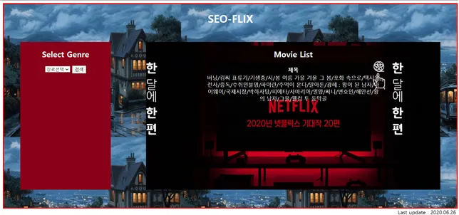

# 영화 추천 사이트 (Movie Recommendation Site)

## 프로젝트 소개

Django 기반의 영화 추천 웹 서비스입니다. 사용자가 원하는 영화 정보를 효율적으로 제공하기 위해 Key-Value Store와 RDBMS를 연동하여 설계하였습니다.

## 기술 스택 (Tech Stack)

- **Framework**: Django
- **Database**:
  - **MariaDB**: 영화 상세 데이터 저장
  - **PickleDB**: Key-Value 매핑 데이터 저장

## 시스템 아키텍처

1. Django에서 요청 수신
2. Key 값을 이용해 PickleDB 조회 → Value 획득
3. 획득한 Value를 Key로 사용하여 MariaDB에서 상세 정보 조회

## 개발 과정 및 시행착오 (Trial and Error)

### 1. 데이터베이스 선정 과정

설계 초기, 적절한 Key-Value Store를 선정하는 데 많은 시행착오가 있었습니다.

- **Redis 시도와 포기**: 초기에는 Redis를 고려했으나, Redis가 주로 In-Memory 캐시(Cache) 용도로 사용된다는 점을 확인했습니다. 이번 프로젝트는 단순 캐싱이 아닌 영구적인 값 저장이 목적이었기에 적합하지 않다고 판단했습니다.
- **대안 탐색**: Django와 연동 가능한 `django-kvstore`, `django-hstore` 등을 검토했으나 프로젝트 환경에 부합하지 않았습니다.

### 2. PickleDB와 MariaDB 연동

최종적으로 Key-Value 기반인 **PickleDB**를 선택하여 MariaDB와 연동하는 방식을 채택했습니다.

- **구조**: Django가 PickleDB에서 Value를 얻고, 이를 이용해 MariaDB 데이터를 불러오는 방식입니다.
- **고찰**: 두 개의 DB를 거치는 과정이 다소 비효율적일 수 있다는 아쉬움이 남지만, Key-Value Store의 개념을 명확히 적용해볼 수 있었습니다.

### 3. 데이터 수집의 어려움

DB 구조 설계 후, 실제 영화 데이터를 수집하는 과정에서 검색만으로는 충분한 양질의 데이터를 확보하는 데 한계가 있었습니다.
